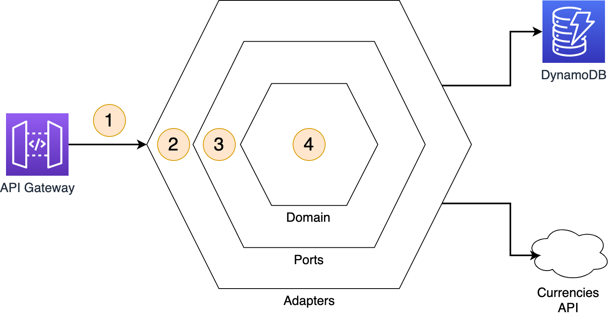
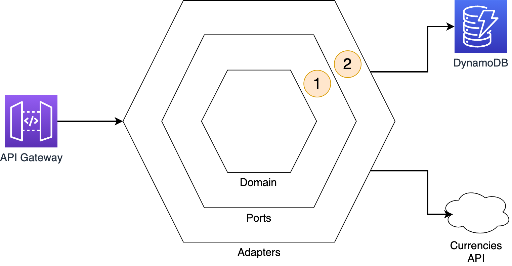
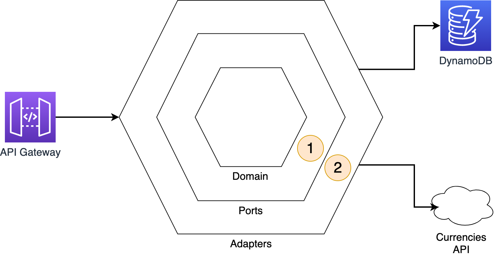
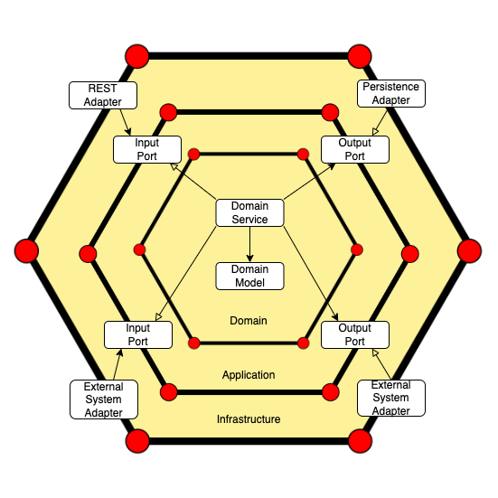
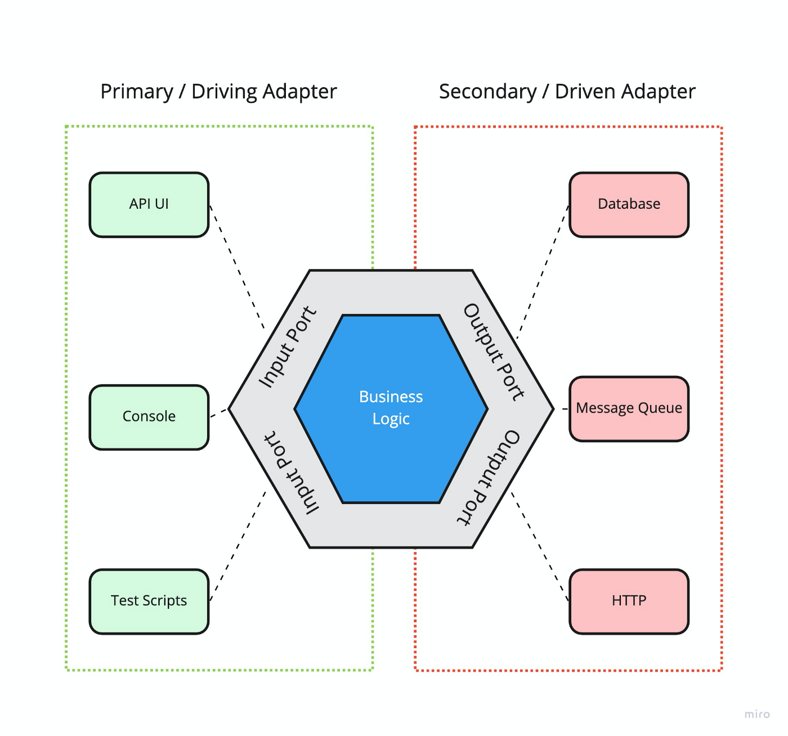
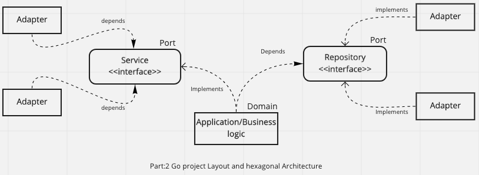

# Developing Evolutionary Hexagonal-Architecture with AWS Lambda

## Context
Agility enables you to evolve a workload quickly, adding new features, or introducing new infrastructure as required. The key characteristics for achieving agility in a code base are loosely coupled components and strong encapsulation.

Loose coupling can help improve test coverage and create atomic refactoring. With encapsulation, you expose only what is needed to interact with a service without revealing the implementation logic.

Evolutionary architectures can help achieve agility in your design. In the book [“Building Evolutionary Architectures”](https://learning.oreilly.com/library/view/building-evolutionary-architectures/9781491986356/), this architecture is defined as one that “supports guided, incremental change across multiple dimensions”.

The project is set up to work on eu-west-1, if you want to deploy in another region please change the code accordingly

If you are interested to learn more about this approach, please read the [blog post associated to this code example](https://aws.amazon.com/blogs/compute/developing-evolutionary-architecture-with-aws-lambda).

## Project
This example provides an idea on how to implement a basic hexagonal architecture with [AWS Lambda](https://aws.amazon.com/lambda/).    
The folder structure represents the three key elements that characterizes the first implementation of an hexagonal architecture: ports, adapters and domain logic.

## Evolving the project

When we want to evolve the application adding a cache-aside pattern using an ElastiCache cluster for reducing the throughput towards a 3rd party service, we can do it applying some changes to the current architecture.    


1. in the ```ports/CurrenciesService``` we comment the first import and uncomment the second one. This will use a new adapter called CurrencyConverterWithCache that contains the logic for the cache-aside patter with ElastiCache Redis cluster

```
//const getCurrencies = require("../adapters/CurrencyConverter");
const getCurrencies = require("../adapters/CurrencyConverterWithCache");
```










